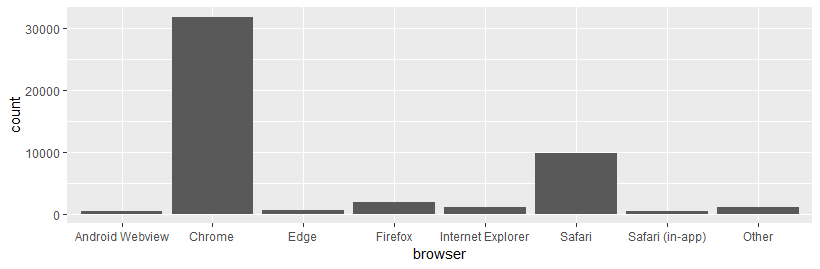
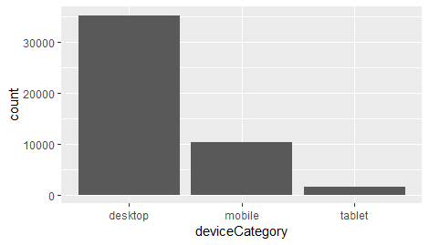
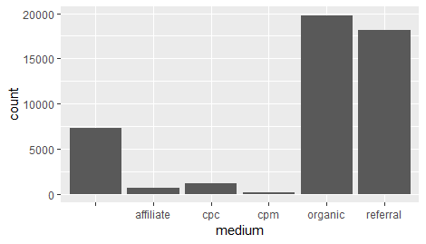
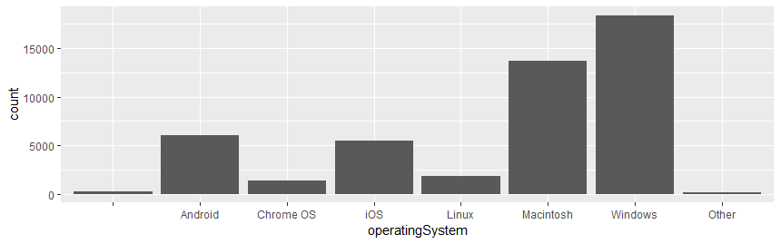
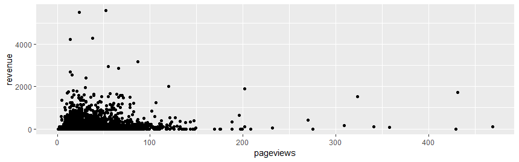

# Online Retail Sales Prediction

## Table of Contents
1. [Problem Description](#problem-description)
2. [Data Understanding](#data-understanding)
3. [Exploratory Data Analysis](#exploratory-data-analysis)
4. [Feature Engineering](#feature-engineering)
5. [Modeling and Hyperparameter Tuning](#modeling-and-hyper-parameter-tuning)
6. [Results and Model Evaluation](#)
7. [Conclusion](#)
## *Problem Description* :
* In many businesses, identifying which customers will make a purchase and how much will they spend, is a critical exercise. This is true for both brick-and-mortar outlets and online stores. 
* The main goal of this project is to predict total expected sales revenue from a customer across all store visits based on their website visit behavior.
* Customers may visit store multiple times on multiple days with or without making a purchase.

## Data Understanding
* ***sessionId***: unique identifier for the record, i.e., a combination of customer and visit number
* ***custId***: unique identifier for each customer
* ***visitNumber***: session number for this customer; if this is the first session, then this is set to 1.
* ***date***: date of the session in YYYY-MM-DD format
* ***channelGrouping***: the channel via which the user came to the online store
* ***visitStartTime***: timestamp
* ***timeSinceLastVisit***: time in seconds since most recent known visit to online store
* ***browser***: browser used, e.g., "Chrome" or "Firefox"
* ***operatingSystem***: version of the operating system
* ***isMobile***: if user is on a mobile device, this value is 1 if true and 0 if false.
* ***deviceCategory***: type of device, e.g., mobile, tablet, desktop
* ***continent***: continent from which sessions originated, based on IP address
* ***subContinent***: sub-continent from which sessions originated, based on IP address
* ***country***: country from which sessions originated, based on IP address
* ***region***: region from which sessions originate, derived from IP addresses, note: in the U.S., a region is a state
* ***metro***: Designated Market Area from which sessions originate
* ***city***: city from which sessions originated, based on IP address
* ***networkDomain***: domain name of user's ISP, derived from the domain name registered to the ISP's IP address
* ***campaign***: the campaign value
* ***source***: origin of your traffic, such as a search engine, e.g., Google; or a domain e.g., example.com
* ***medium***: general category of source, e.g., organic search "organic", cost-per-click paid search "cpc", web referral "referral"
* ***keyword***: keyword of the traffic source, usually set when the trafficSource.medium is "organic" or "cpc"
* ***isTrueDirect***: True, value =1, if the source of the session was Direct meaning the user typed the name of your website URL into the browser or came to your site via a bookmark
* ***referralPath***: if trafficSource.medium is "referral", then this is set to the path of the referrer. The host name of the referrer is in trafficSource.source.
* ***adContent***: ad content of the traffic source
* ***adwordsClickInfo***.page: page number in search results where the ad was shown
* ***adwordsClickInfo.slot***: position of the ad. Takes one of the following values:{“RHS", "Top"}
* ***adwordsClickInfo.gclId***: Google Click ID
* ***adwordsClickInfo.adNetworkType***: takes one of the following values: {"Google Search", "Search partners", "unknown"}
* ***adwordsClickInfo.isVideoAd***: True if it is a Trueview video ad.
* ***pageviews***: total number of pageviews within the session; a pageview is an instance of a page being loaded or reloaded in a browser
* ***bounces***: for a bounced session, the value is 1, otherwise it is null; a bounce is when the visitor leaves the website from the landing page without browsing any further
* ***newVisits***: if this is the first visit for the customer, this value is 1, otherwise it is null.
* ***revenue***: total transaction revenue for the session -- Note! This is the outcome variable of interest

### File descriptions
* Train.csv - the training set
* Test.csv - the test set

## Exploratory Data Analysis

### Most Used Browser 

* From the above plot, we can observe chrome is major browser used by customers and is also major source for total revenue.

 ### Dominant Device Category 

* From the above pot, we can observe that desktop is major contributor total revenue.

### Medium of Website Visit

* Organic and Referral medium are dominant categories of medium of customer website behavior.

### Widely Used Operating System 

* From the above bar plot, we can see Windows and Mac operating systems are dominant which is true as most visits are through desktop.
### Number of Page views vs Revenue of Visit

* Though there is no simple linear relationship between pageviews and revenue generated from customer visit, we can see most of the page views where revenue generated is less than 100.

## Feature Engineering
* To aggregate features of customers across their online visits, mean, median and standard deviation are used for numerical features and mode is used for categorical features.
* Response variable revenue is added up by each custmer ID across all their visits and log transformation is applied.
* New features are used to predict log of sales revenue expected from each customer.

## Modeling and Hyper Parameter Tuning

* Code for this problem can be found here [Revenue Prediction](./Revenue-Prediction.R)

* Multiple models ranging from Ordinary Least Squares to Gradient Boosting Machines are modelled on the training data and evaluated on test data and best model is selected 
across OLS, MARS, ELASTICNET, SVM & GBM.

* Interestingly, Tree based model GBM performed better than other models.

**This Problem is hosted as an in-class kaggle competition for course Intelligent Data Analytics 
during my masters in Data Science and Analytics at University of Oklahoma.**

Team Name: ***_Team Test Data-5_***\
Web Link to the Kaggle competition and LeaderBoard can be found here [Kaggle](https://www.kaggle.com/c/2021-5103-hw6/leaderboard)
